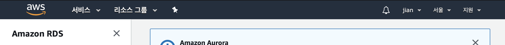
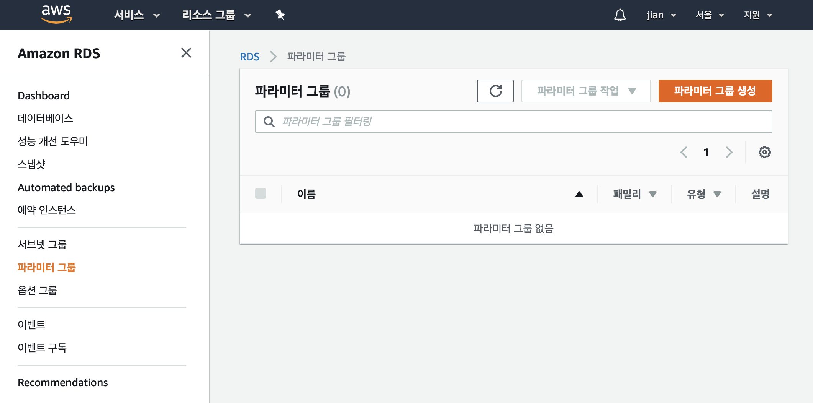
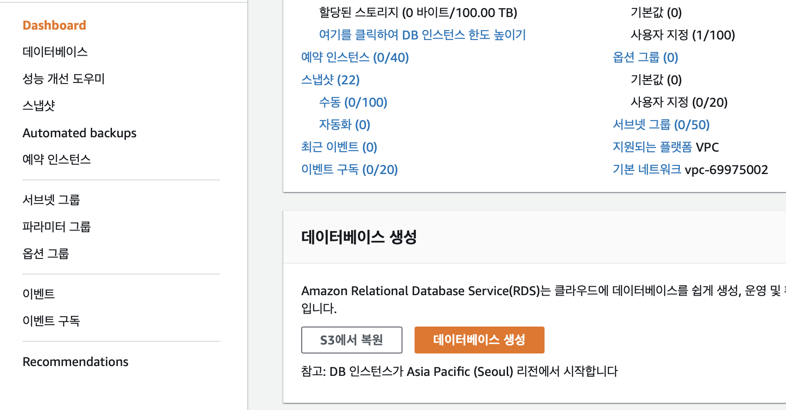

# AWS에 배포하기
목표 : MySQL 데이터베스에 우분투 서버 2대에 미니터 API 배포하고, 그 앞에 load balancer를 붙이는 구조

 

## RDS
> Relational Database Service  

AWS에서 제공하는 데이터베이스 서비스

먼저, **RDS 서비스** 페이지로 접속해 지역이 **서울**로 되어있는지 확인. 
  

MySQL 설정 파일이 default로 존재하지만, 한국어를 처리해야 하므로 인코딩을 UTF-8로 바꿔줘야한다.  
**파라미터 그룹** 메뉴에서 파라미터 그룹을 새로 생성한다.
  

생성 후, 다음과 같이 설정해준다.
* 다음 파라미터들을 utf8mb4로 변경
  * chracter_set_client
  * chracter_set_connection
  * chracter_set_database
  * chracter_set_result
  * chracter_set_server
* collation_connection -> utf8mb4_general_ci
* collation_server -> utf8mb4_unicode_ci

이제 **Dashboard** 메뉴로 돌아가 **데이터베이스 생성** 을 클릭한다.
  
DB는 MySQL 5.7, 템플릿은 프리티어를 선택한다.  
파라미터 그룹을 직전에 생성한 파라미터 그룹으로 설정  