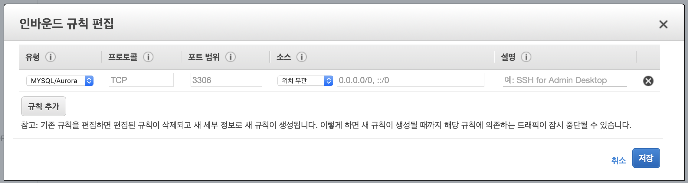
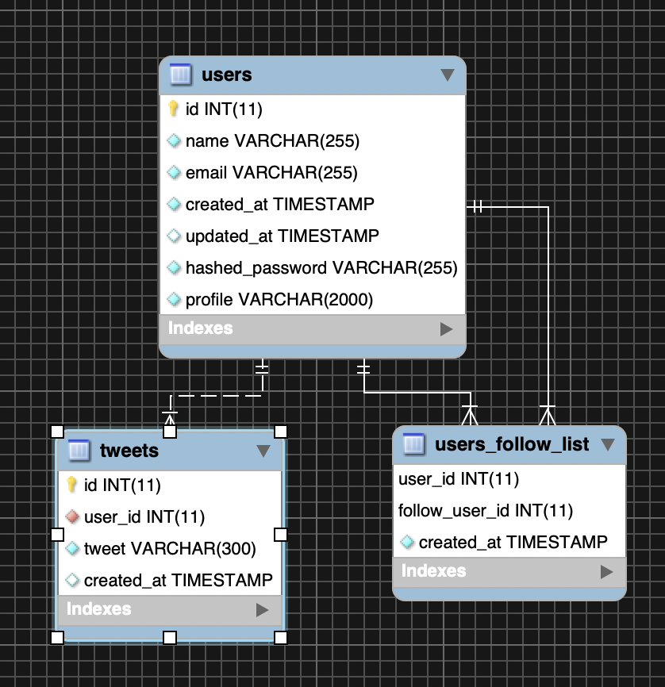

# AWS에 배포하기
MySQL 데이터베스에 우분투 서버 2대에 미니터 API 배포하고, 그 앞에 load balancer를 붙이는 구조
#### 목차
* [RDS](#rds)
* [EC2](#ec2)
* [ALB](#alb)
<br>

## RDS
> Relational Database Service  

AWS에서 제공하는 데이터베이스 서비스

먼저, **RDS 서비스** 페이지로 접속해 지역이 **서울**로 되어있는지 확인. 
  

MySQL 설정 파일이 default로 존재하지만, 한국어를 처리해야 하므로 인코딩을 UTF-8로 바꿔줘야한다.  
**파라미터 그룹** 메뉴에서 파라미터 그룹을 새로 생성한다.
  

생성 후, 다음과 같이 설정해준다.
* 다음 파라미터들을 utf8mb4로 변경
  * chracter_set_client
  * chracter_set_connection
  * chracter_set_database
  * chracter_set_result
  * chracter_set_server
* collation_connection -> utf8mb4_general_ci
* collation_server -> utf8mb4_unicode_ci

이제 **Dashboard** 메뉴로 돌아가 **데이터베이스 생성** 을 클릭한다.
  
DB는 MySQL 5.7, 템플릿은 프리티어를 선택한다.  
파라미터 그룹을 직전에 생성한 파라미터 그룹으로 설정  

생성된 데이터베이스의 **security group** 을 선택해 인바운드 규칙을 다음과 같이 수정한다.  
  
인바운드란 외부에서 인스턴스로 들어오는 요청인데, 원래 어디서든 접속가능하게 하는건 보안상 ㅂㄹ... 하지만 실습용이니 이렇게 설정한다..  

이제 터미널에서 다음 명령어를 사용해 DB에 접속한 후, 기존에 만들었던 미니터 api의 DB와 table들을 만들면 된다. (또는 MySQL 워크벤치로 ㅎㅎ)

```
mysql -h <endpoint> -u <master username> -p
```
<center></center>
요까지 하면 RDS 셋팅은 끝..!

